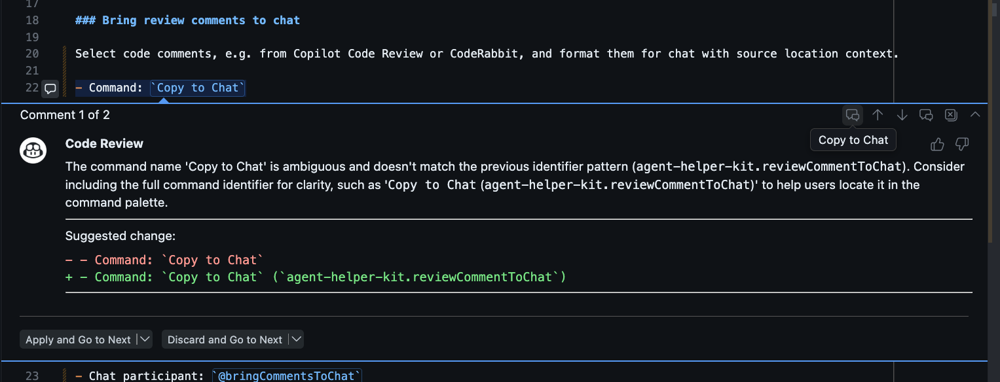
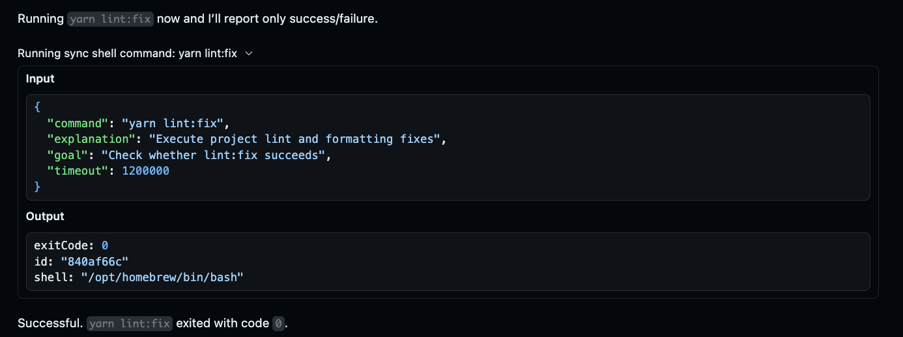

# Agent Helper Kit

Agent Helper Kit is a VS Code extension for developers who want faster AI-assisted workflows inside the editor.

It focuses on two practical jobs:

- Move code review comments into chat with file/line context.
- Provide reliable shell tools for agent workflows that need command status and structured output.

## AI-Enhanced Project

**A large portion of this extension was generated via an AI-first development flow:**

- **agent environment / orchestration layer:** Github Copilot Chat in VS Code
- **main lead agents:** GPT-5.3-Codex, GPT-5.4
- **reviewing agents:** Claude Opus 4.6, Gemini 3.1 Pro, Raptor mini
- **reviewing tools:** Copilot Code Review, CodeRabbit

I have reviewed the code for accuracy and tested thoroughly. Please use caution when using this extension in your IDE.

## Why use it

- Keep review context in one place while you prompt and fix code.
- Run shell commands through extension-owned tools with consistent IDs and status tracking.
- Use async and sync flows depending on whether you need background execution or immediate completion.

## Features

### Bring review comments to chat

Select code comments, e.g. from Copilot Code Review or CodeRabbit. When all are selected, run the command or call up the chat participant to include them in the chat context, formatted and with source location context.

- Command: `Copy to Chat` (`agent-helper-kit.reviewCommentToChat`)
- Chat participant: `@bringCommentsToChat` (`agent-helper-kit.bringCommentsToChat`)

### Agent-friendly shell tools

Compared with built-in terminal tools, these extension tools are optimized for agent workflows.

Benefits:

- Deterministic command lifecycle with stable IDs you can await, poll, and kill.
- Structured metadata (`exitCode`, `terminationSignal`, `timedOut`, `shell`) that is easier to automate against.
- Output controls (`full_output`, `last_lines`, `regex`) to reduce context noise in chat.
- `run_in_sync_shell` is optimal for single- or multi-step deterministic commands.
- `run_in_async_shell` is optimal for long-running detached jobs plus explicit polling.

Tradeoffs:

- No interactive terminal session (these are command-execution APIs, not full terminal UIs).
- No state/environment persistence between command runs, each command runs in a fresh shell instance.

## Configuration

- `agent-helper-kit.bringToChat.enabled`: enable or disable bring-to-chat actions.
- `agent-helper-kit.shellTools.enabled`: enable or disable shell tool registration.
- `agent-helper-kit.shellOutput.memoryToFileSpillMinutes`: minutes to keep output in memory before spilling to file.
- `agent-helper-kit.shellOutput.startupPurgeMaxAgeHours`: startup cleanup threshold for old persisted output.

## Contributing

- Open a ticket for bug reports, questions, and feature suggestions.
- Pull requests are welcome for fixes and improvements.
- Before opening a PR, run `yarn lint:check` and `yarn test`.

## License

MIT - see [LICENSE](LICENSE).
