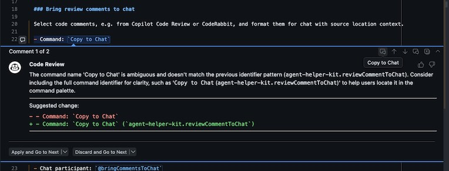
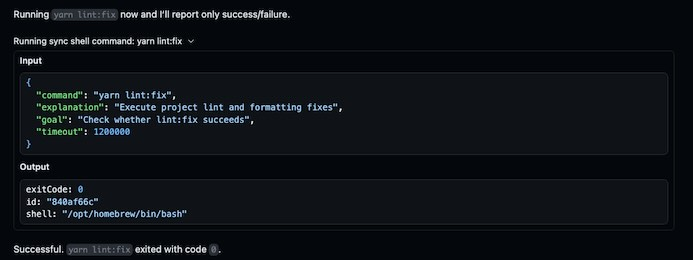
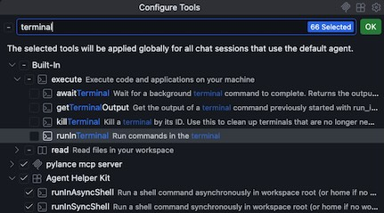

# Agent Helper Kit

Agent Helper Kit is a VS Code extension for developers who want faster AI-assisted workflows inside the editor.

It focuses on two practical jobs:

- Move code review comments into chat with file/line context.
- Provide reliable shell tools for agent workflows that need command status and structured output.

## Features

### Bring review comments to chat

Select code comments, e.g. from Copilot Code Review or CodeRabbit, to format and include them in the chat context, with source location context.

By default, each `Copy to Chat` click sends that review comment straight into chat history. If you prefer batching, enable `agent-helper-kit.bringToChat.queueBeforeSend` to enqueue the comments. When ready, call up the chat participant `@bringCommentsToChat` (should be already prefilled) and all enqueued comments are then brought in.

- Command: `Copy to Chat` (`agent-helper-kit.reviewCommentToChat`)
- Chat participant: `@bringCommentsToChat` (`agent-helper-kit.bringCommentsToChat`)

### Agent-friendly shell tools

Compared with built-in terminal tools, these extension tools are optimized for agent workflows.

**Benefits:**

- Deterministic command lifecycle with stable IDs you can await, poll, and kill.
- Structured metadata (`exitCode`, `terminationSignal`, `timedOut`, `shell`) that is easier to automate against.
- Output controls (`full_output`, `last_lines`, `regex`) to reduce context noise in chat.
- Approval flow that combines explicit allow/ask/deny rules with optional model-based risk assessment, while treating transient env-var prefixes and detected file-target output redirections conservatively.
- `run_in_shell` is optimal for both deterministic commands, and long-running detached jobs: omit `timeout` to start immediately and poll later, or provide `timeout` to wait for completion up to that many milliseconds.
- If that wait times out, the tool returns `timedOut: true` with the command id and leaves the process running until it exits naturally or you call `kill_shell`.

**Tradeoffs:**

- No interactive terminal session (these are command-execution APIs, not full terminal UIs).
- No state/environment persistence between command runs, each command runs in a fresh shell instance.

**Recommendation:** for development flows where most or all commands are non-interactive and require no environment state persistency, you can disable the built-in terminal tools.

## Configuration

- `agent-helper-kit.bringToChat.enabled`: enable or disable bring-to-chat actions.
- `agent-helper-kit.bringToChat.queueBeforeSend`: queue comments and bring-all-to-chat flow instead of immediate send on each click.
- `agent-helper-kit.shellTools.enabled`: enable or disable shell tool registration.
- `agent-helper-kit.shellTools.autoApprovePotentiallyDestructiveCommands`: dangerous YOLO override that auto-approves unresolved commands before any risk-assessment prompt runs; explicit `allow`, `ask`, and `deny` rules still override it.
- `agent-helper-kit.shellTools.riskAssessment.chatModel`: model ID used to pre-assess shell command risk after explicit rules and before user confirmation; leave empty to disable model-based risk assessment and fall back to explicit rules plus the YOLO setting.
- `agent-helper-kit.shellTools.riskAssessment.timeoutMs`: timeout for shell risk-assessment prompts. On timeout or other risk-assessment failure, unresolved commands fall back to explicit approval.
- `agent-helper-kit.shellTools.approvalRules`: override shell tool approval rules with per-command or regex-based `allow`, `ask`, and `deny` entries.
- `agent-helper-kit.shellOutput.inMemoryOutputLimitKiB`: KiB of shell output to keep in memory before immediately spilling to a temp file. Set to `0` to disable the size-based spill threshold.
- `agent-helper-kit.shellOutput.memoryToFileSpillMinutes`: minutes to keep output in memory before spilling to file.
- `agent-helper-kit.shellOutput.startupPurgeMaxAgeHours`: startup cleanup threshold for old persisted output.

Use the Command Palette action `Select Shell Risk Assessment Model` to choose or clear the chat model behind `agent-helper-kit.shellTools.riskAssessment.chatModel`.

When using `run_in_shell`, provide:

- `explanation`: what the command does.
- `goal`: why the command is being run.
- `riskAssessment`: a brief pre-assessment of possible destructive effects, sensitive-data leakage, data loss, or system impact.
- `riskAssessmentContext` (optional): additional risk context. Use file paths for scripts the command executes, and inline strings for relevant sub-actions, package scripts, alias expansions, or fetched-content details that help explain what the command ultimately runs.

Use `timeout` only to control how long the tool waits before replying. It does not limit or kill the underlying process. Omit `timeout` to start the command asynchronously, use `0` to wait without a limit, and call `kill_shell` yourself if a long-running command should stop.

Transient env-var prefixes such as `FOO=bar cmd` do not automatically force manual approval in this extension. Instead, the approval engine strips those prefixes for rule matching, preserves matching `ask` and `deny` rules, and downgrades matching `allow` rules to model-based risk assessment.

Detected file-target output redirections such as `> out.txt`, `>> build.log`, or `>| output.txt` are handled similarly: matching `ask` and `deny` rules still apply, but matching `allow` rules no longer auto-run those file-writing variants.

## Contributing

- Use Node.js 22.13+ or 24+ for local development.
- Open a ticket for bug reports, questions, and feature suggestions.
- Pull requests are welcome for fixes and improvements.
- Before opening a PR, run `yarn lint:check` and `yarn test`.

## License

MIT - see [LICENSE](./LICENSE).
